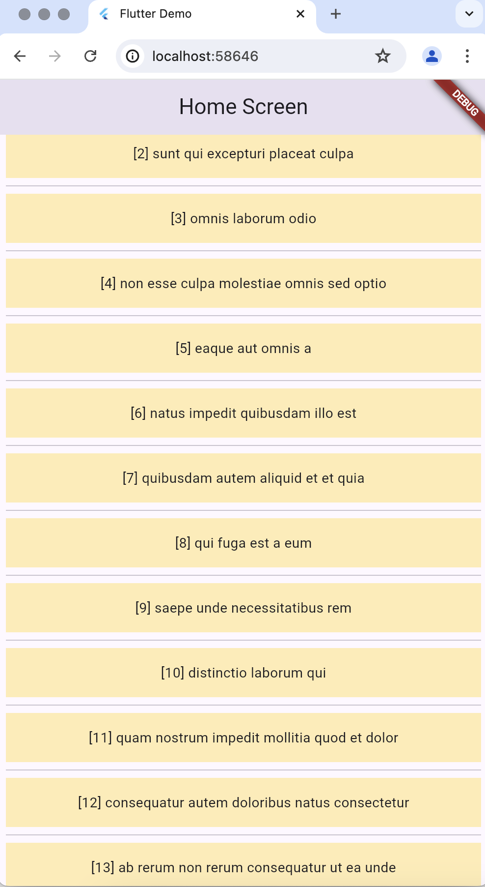

# user_session

## This project contain 
This is project made in Flutter. It is having three screen 

1. Splash 
2. Login 
3. Sign up 
4. Home 

this project is the learning only, technically it includes 
1. StatelessWidget
2. Rounter 
3. Text 
4. Imageview 
5. layout , alignment , padding , margin. 
6. form validation. 
7. Provider 
8. Api calling 
9. listview

## screenshots 

###  Bug list

- [ ] When click on back button in chrome browser it shows crashed
 - [ ] ui overlap with the keyboard when 
